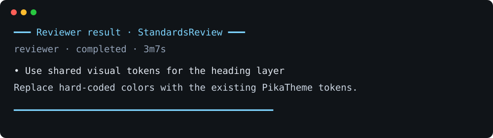

# OMP Task Result Panel

Displays results from any OMP `task` run as clean panels in the main transcript.



Small results are shown inline. Large results stay as compact previews; open the complete artifact in OMP's focused multiline viewer with:

```text
/task-results-view <task-id>
```

Omit `<task-id>` to open the latest large result. Full output remains available after restarting OMP.

## Install

```sh
omp plugin install github:mattyg/oh-my-pi-task-result-panel
```

